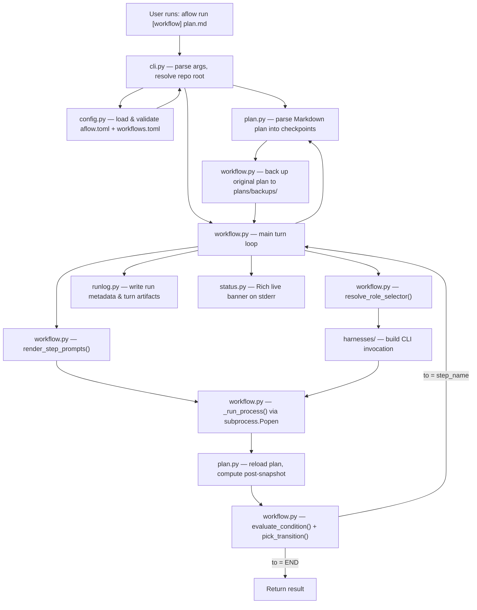

# Architecture

AFlow is a plan-driven workflow orchestrator that runs coding tasks through existing AI agent CLIs (Claude, Codex, Gemini, Kiro, OpenCode, Pi, and Reasonix). It reads a checkpoint-based Markdown plan, dispatches steps to configurable harness profiles, evaluates condition-based transitions between steps, and logs every turn to disk.

## High-Level Data Flow



## Module Breakdown

### `cli.py`
Entry point. Exposes three subcommands:
- **`aflow run [plan_or_workflow ...] [-- extra instructions]`** -- runs a workflow.
  - Plan path and workflow name are resolved from explicit flags (`--plan`/`-p`, `--workflow`/`-w`) and/or positional arguments.
  - Two positionals are resolved intelligently by file existence and workflow name validity; one positional is always treated as the plan path.
  - `--start-step`/`-ss` accepts either a workflow step name or a 1-based numeric index into the declared workflow step order.
  - `--resume [RUN_ID]` forces resume mode. With no `RUN_ID`, the CLI must resolve a resumable previous run from shell-local state or fail. With `RUN_ID`, the CLI resumes that exact run or fails.
- **`aflow install-skills [destination]`** -- copies bundled skills into harness skill directories.
  - The default install set is the nine default bundled skills, including `aflow-harness-recovery-lead`.
  - `--include-optional` adds optional bundled skills such as `aflow-assistant`.
  - `--only` installs exactly the named skill(s).
- **`aflow show [workflow_name]`** -- renders workflow diagrams and the effective role/team relationships from the loaded config.
  - With no workflow name, it prints a shared roles/teams section followed by every workflow in config order.
  - With a workflow name, it prints only that workflow plus the roles and teams that apply to it.
- **`aflow analyze [RUN_ID] [--all]`** -- analyzes run logs from `.aflow/runs/`.
  - Single-run mode resolves the target run in `analyzer.py`, and the CLI delegates to `aflow.api.analyze.analyze_runs()` so library callers get the same behavior.

`main()` resolves `aflow run` startup in this order:

1. Parse CLI arguments into explicit flags (`--plan`, `--workflow`, `--start-step`, `--team`, `--max-turns`) and remaining positional tokens.
2. Ensure `~/.config/aflow/aflow.toml` and sibling `workflows.toml` exist. If either file was created, print both paths and exit so the user can edit them first.
3. Load and validate the workflow config.
4. Resolve positional tokens and explicit flags into a canonical plan path and workflow name using these rules:
   - One bare positional means plan path only.
   - Two bare positionals are resolved by checking whether each token is an existing plan file or a configured workflow name. If both resolve uniquely, they are assigned accordingly. If both could match both categories, neither matches both, or both could be plans, the CLI exits with a clear ambiguity error.
   - Positional and flag values for the same field are allowed only if they resolve to the same canonical value; conflicting values cause an error with the specific conflict.
5. Resolve any numeric `--start-step` value to a canonical workflow step name by validating the index against the selected workflow's declared step order. Out-of-range indexes fail with a clear bounds error listing the valid range.
6. Load the original plan strictly.
7. If the plan is complete and `--start-step` was given, fail with a clear error.
8. If the plan is half-done and the workflow has more than one step, require a TTY and prompt for an explicit step unless `--start-step` was given.
9. If strict plan loading fails with `inconsistent_checkpoint_state`, require a TTY and ask whether to recover.
10. When recovery is accepted, load a tolerant snapshot from the invalid plan, seed startup retry state, and pass both the parsed plan and retry context into `run_workflow()`.

### `analyzer.py`
Analyzes `.aflow/runs/` artifacts and powers `aflow analyze`.
- Single-run mode resolves the run in this order: explicit `RUN_ID` argument, the current shell's `.aflow/last_run_ids/<shell-id>` entry when available, `AFLOW_LAST_RUN_ID` environment variable, then `.aflow/last_run_id`.
- `--all` switches to corpus mode, which summarizes multiple runs instead of one.
- The bundled assistant skill uses this command as its primary evidence-first entrypoint.

### `config.py`
Loads `~/.config/aflow/aflow.toml` plus sibling `workflows.toml` (bootstrapped from the bundled defaults on first run). Parses and validates:
- **`[aflow]`** section: `default_workflow`, `keep_runs`, `max_turns`, `retry_inconsistent_checkpoint_state`, `banner_files_limit`, `max_same_step_turns`, `team_lead`, `branch_prefix`, `worktree_prefix`, `worktree_root`.
- **`[harness.<name>.profiles.<profile>]`** tables: `model`, optional `effort` per harness profile.
- **`[roles]`** and **`[teams.<name>]`** tables: role-to-selector mappings, with team tables allowed to override a subset of the global map and optionally name a `backup_team` for harness recovery chaining.
- **`[error_handling.harness_error_recovery]`**: ordered recovery rules, `max_consecutive_recoveries`, and the bundled fallback skill name used when deterministic matching cannot decide safely.
- **`[prompts]`** section: named prompt templates.
- Bare **`[workflow]`** table in `workflows.toml`: lifecycle defaults (`setup`, `teardown`, `main_branch`, `merge_prompt`) inherited by all workflows that don't override them. Not a runnable workflow.
- **`[workflow.<name>]`** tables in `workflows.toml`: concrete workflows define `steps`, alias workflows use `extends` and optional `team`. Both may override lifecycle defaults with `setup`, `teardown`, `main_branch`, and `merge_prompt`.
- Concrete and alias workflows may also set `exclude = ["step_name"]` to remove declared steps from the executable graph while keeping them visible to `aflow show` and the live banner. Alias exclusions are applied after inheritance.
- **`[workflow.<name>.steps.<step>]`** tables: `role` (global role key), `prompts` (list of prompt keys), `go` (transition array with `to` and optional `when` condition).

Lifecycle validation enforces that `(setup, teardown)` is one of three accepted tuples: `([], [])`, `(["branch"], ["merge"])`, or `(["worktree", "branch"], ["merge", "rm_worktree"])`. Any other combination is rejected at load time with the exact workflow path.

When a workflow's effective `teardown` includes `merge`, validation also checks that `[aflow].team_lead` is set and, for config-defined teams, that the role can be resolved through team overrides or global `[roles]`.

Cross-validates that harness profiles, roles, teams, prompts, aliases, and transition targets all reference things that exist.

### `plan.py`
Parses a Markdown plan file into structured checkpoint data. Expects `### [x] Checkpoint ...` headings (h3 with checkbox) and `- [ ] step` items underneath. Produces a `PlanSnapshot` with:
- `current_checkpoint_name`, `current_checkpoint_index`
- `unchecked_checkpoint_count`, `current_checkpoint_unchecked_step_count`
- `is_complete` (all checkpoints checked)
- `total_checkpoint_count`

Also detects `## Git Tracking` sections required by review skills.

### `workflow.py`
The core engine. `run_workflow()` executes the turn loop:

1. Back up the original plan to `plans/backups/`.
2. Parse the plan unless `main()` already provided a pre-loaded `ParsedPlan`.
3. If the workflow's `setup` is non-empty, inspect the repo state at `repo_root`. If no `.git/` directory exists or the repo has no commits, auto-bootstrap runs before lifecycle preflight: `run_workflow()` probes the repo state via `probe_repo_state()`, determines that bootstrap is needed, runs git-independent preflight (plan path existence, worktree root, `main_branch` config), then invokes the team-lead bootstrap handoff. The handoff resolves `[aflow].team_lead` exactly as merge teardown does, constructs a `README.md` title and body from the plan preamble via `derive_readme_content()`, and runs the agent from the primary checkout using the built-in `aflow-init-repo` skill instruction. At startup, the CLI also checks live `## Git Tracking` metadata before dirty-worktree prompts: if `Pre-Handoff Base HEAD` is empty or stale on a pristine handoff, it can capture approval to refresh that field to the current `git rev-parse HEAD` value; if the handoff already has checkpoint or review progress, the same mismatch fails instead of refreshing. That approved refresh state is passed into `run_workflow()` and applied only after lifecycle setup has created the execution context and before the first prompt is rendered. After the agent returns, the engine verifies: `HEAD` resolves to a commit, `HEAD` is on `main_branch`, `README.md` exists and is tracked, and the working tree has no tracked-file dirtiness. Only after bootstrap verification passes does `run_workflow()` continue into the git-dependent phase of lifecycle preflight. For already-committed repos, bootstrap is skipped entirely and the original behavior is preserved. If git is missing, lifecycle workflows fail early with a clear bootstrap error. Preflight validates: branch name collision, worktree path collision, correct startup branch, that `main_branch` points to a local commit, and (for worktree workflows only) that any dirty files in the primary checkout are confined to `plans/` (untracked or gitignored plan files are allowed). For non-worktree workflows, the working tree must be clean. Branch-only setup creates a local feature branch from `main_branch` in the primary checkout. Worktree setup creates a linked worktree from `main_branch` under `worktree_root` and creates the feature branch inside that worktree. The primary checkout remains the control root for run artifacts; the worktree is the execution root for normal steps.
4. For each turn (up to `max_turns`):
   a. Reload the plan from disk (the agent may have modified it). For worktree flows, plan path placeholders (`{ORIGINAL_PLAN_PATH}`, `{ACTIVE_PLAN_PATH}`, `{NEW_PLAN_PATH}`) are translated from primary-root-relative to worktree-root-relative before being handed to the agent; they are translated back after the turn.
   b. For worktree flows, sync the original plan into the worktree before rendering prompts (so untracked plans under `plans/` are available for the agent to read and modify).
   c. Resolve the step's role through the selected team and global role map to get the concrete harness selector.
   d. Render prompt templates with path placeholders.
   e. Build a `HarnessInvocation` via the adapter, using `execution_repo_root` as the subprocess cwd.
   f. Run the agent CLI as a subprocess, streaming stdout/stderr.
   g. For worktree flows, sync the original plan back from the worktree to the primary checkout immediately after the harness returns (before parsing post-turn state). This ensures the primary copy reflects any edits the harness made, even if the harness exited with non-zero status.
   h. Before reloading the plan, scan stdout and stderr for a line starting with `AFLOW_STOP:`. If found, fail the run immediately with the extracted reason without entering the plan-reload or transition path.
   i. Reload the plan again to get the post-turn snapshot. If the plan is left in an inconsistent checkpoint state (heading marked complete but unchecked steps remain) and the harness exited cleanly, a retry may be scheduled instead of failing immediately (see `retry_inconsistent_checkpoint_state`).
   j. Evaluate `go` transitions using condition symbols (`DONE`, `NEW_PLAN_EXISTS`, `MAX_TURNS_REACHED`).
   k. Log turn artifacts and update run metadata.
   l. If transition target is `END`, return. For multi-step workflows, check the same-step cap: if the same step has been selected consecutively `max_same_step_turns` times, fail the run before starting the next turn. Otherwise, advance to the next step.

   Harness error recovery is inserted after the harness returns and before normal transition handling. If the turn made no plan progress and a configured error-handling rule matches the harness output, the engine applies the first deterministic rule in order. Rules can keep the same team, switch to a configured `backup_team`, or fail immediately. When no deterministic rule matches, the engine escalates to the configured team lead through the bundled `aflow-harness-recovery-lead` skill and expects a strict machine-readable decision. Progress-gated turns skip recovery entirely and continue on the normal transition path.
5. After normal workflow completion, if `teardown` includes `merge`, execute the merge handoff: resolve `[aflow].team_lead` through the effective team, build a merge prompt (built-in `aflow-merge` instruction plus rendered `merge_prompt` entries), and run the `team_lead` agent from the primary checkout. After the agent returns, verify: no unmerged index entries, clean working tree, HEAD on `main_branch`, and feature branch is an ancestor of the target. Only after all checks pass does `rm_worktree` (if configured) remove the linked worktree. Any verification failure leaves the feature branch and worktree intact and fails the run with the specific failed check.
6. If the workflow uses the worktree+branch lifecycle, `aflow` can resume an unfinished prior run. Resume candidate lookup resolves the previous run id through the current shell's `.aflow/last_run_ids/<shell-id>` entry when it can detect one, then `AFLOW_LAST_RUN_ID`, then `.aflow/last_run_id`, unless `--resume RUN_ID` supplied an explicit run id. A run is resumable only when `run.json` shows a worktree lifecycle with recorded feature branch and worktree path, status `failed` or `running`, `last_snapshot.is_complete != true`, no `merge_status`, and the resolved invocation still matches on repo root, workflow name, absolute plan path, effective team, selected start step, max turns, extra instructions, and lifecycle setup. Plain `aflow run` treats that as an optional interactive prompt in TTY mode and otherwise falls back to the fresh-run path. `aflow run --resume` makes resume mandatory: with no run id it must resolve a prior run from that lookup order or fail; with a run id it must use that run or fail. Accepted resume builds a `ResumeContext` from the recorded branch and worktree, validates that worktree before execution, and starts `run_workflow()` directly in the reused execution context instead of provisioning a fresh one. The plan file on disk still remains the durable checkpoint state.

A scheduled retry skips the pre-turn plan reload and reuses the last valid snapshot and saved prompt context. The same `ACTIVE_PLAN_PATH`, `NEW_PLAN_PATH`, and resolved step selector are reused; the retry appendix (containing the exact parse error) is added to the prompt. Startup recovery seeds that same retry machinery by passing a `RetryContext` into `run_workflow()`, which stores the step name, role, resolved selector, and prompt context in `state.pending_retry` before turn 1. Retry turns still count toward `max_turns`.

The condition evaluator is a full recursive-descent parser supporting `&&`, `||`, `!`, and parentheses over the three condition symbols.

Prompt templates support `file://` references (absolute, config-relative, or cwd-relative).

### `harnesses/`
Adapter layer. Each harness implements `HarnessAdapter.build_invocation()` to produce a `HarnessInvocation` (argv, env, prompt texts). Eight adapters:

| Harness    | CLI binary  | Prompt mode                    | Effort support |
|------------|-------------|--------------------------------|----------------|
| `claude`   | `claude`    | `--system-prompt` flag         | Yes            |
| `codex`    | `codex`     | system prefixed into user prompt | Yes          |
| `copilot`  | `copilot`   | system prefixed into user prompt | Yes          |
| `gemini`   | `gemini`    | system prefixed into user prompt | No           |
| `kiro`     | `kiro-cli`  | system prefixed into user prompt | No           |
| `opencode` | `opencode`  | system prefixed into user prompt | No           |
| `reasonix` | `reasonix`  | system prefixed into user prompt | No           |
| `pi`       | `pi`        | `--system-prompt` flag         | Yes            |

All harnesses run in non-interactive, auto-approve mode with full tool access.

### `run_state.py`
Data classes for runtime state:
- `ControllerConfig` -- immutable run parameters (repo root, plan path, max turns, keep runs, extra instructions).
- `ControllerState` -- mutable per-run state (snapshot, turn count, issues, timing, status, pending retry context, consecutive same-step streak tracking).
  - Also carries the current run id and, for resumed runs, the source run id so the banner and startup output can surface both immediately.
- `RetryContext` -- frozen dataclass holding everything needed to rerun the same step on the next turn without re-parsing the broken plan (step name, role, resolved selector, pre-failure snapshot, saved plan paths, base prompt, parse error string, attempt counter, retry limit).
- `ExecutionContext` -- frozen dataclass holding lifecycle execution state: `primary_repo_root`, `execution_repo_root` (worktree path for worktree flows, same as primary for branch-only), `main_branch`, `feature_branch`, `worktree_path` (or `None` for branch-only), `setup`, `teardown`.
- `ControllerConfig` also carries the selected startup step, if any, so the workflow loop can start from a non-default step without re-parsing CLI arguments.
- `ControllerRunResult` -- final result with end reason.
- `WorkflowEndReason` -- literal type: `already_complete`, `done`, `max_turns_reached`, `transition_end`.

### `runlog.py`
Persists run data under `.aflow/runs/<timestamp>-<uuid>/`:
- `run.json` -- run-level metadata, updated after each turn.
- `turns/turn-NNN/` -- per-turn artifacts: `system-prompt.txt`, `user-prompt.txt`, `effective-prompt.txt`, `argv.json`, `env.json`, `stdout.txt`, `stderr.txt`, `result.json`.
- `create_run_paths()` also writes `.aflow/last_run_id` immediately after the run directory is created, and writes `.aflow/last_run_ids/<shell-id>` when a stable shell/session id is available, so later `aflow analyze` invocations can prefer shell-local state without losing the repo-wide fallback if the workflow fails mid-run.

Prunes old run directories to respect `keep_runs`.

### `git_status.py`
Git snapshot helpers used by the banner and CLI. Provides three public data classes (`GitBaseline`, `GitSummary`, `WorktreeProbe`) and three functions:
- `probe_worktree(repo_root)` — checks whether the working tree is dirty at startup.
- `capture_baseline(repo_root)` — snapshots the current HEAD SHA and a working-tree tree OID (using a temporary `GIT_INDEX_FILE`) as a before-run baseline.
- `summarize_since_baseline(repo_root, baseline)` — compares the current working tree against the baseline and returns file-change counts, net line deltas, commit count, and changed paths.

All three functions return `None` when git is unavailable or fails, so the workflow always runs regardless of git state.

### `status.py`
Rich-based live banner rendered to stderr during a run. Shows elapsed time, run id, resumed-from run id when present, workflow/step name, harness, model, checkpoint progress, turn count, issues, plan paths, git summary (if available), and status.
The module also owns the shared workflow-graph and role/team render helpers used by both the live banner and `aflow show`, so classification rules stay identical across the two views.

`BannerRenderer` owns a background daemon thread that rebuilds and pushes the panel every `refresh_interval_seconds` (default 1 s) and polls for a new `GitSummary` every `git_poll_interval_seconds` (default 10 s). This keeps the elapsed timer alive between step transitions without requiring external pushes. `set_context(...)` is used to update mutable banner fields instead of directly writing private attributes.

### `skill_installer.py`
Discovers the nine default bundled skills plus the optional bundled skills from package resources, and copies the selected set into harness-specific skill directories. `BUNDLED_SKILL_NAMES` is the full sorted inventory of valid bundled skill names, while `DEFAULT_BUNDLED_SKILL_NAMES` and `OPTIONAL_BUNDLED_SKILL_NAMES` preserve install behavior. The default inventory includes `aflow-harness-recovery-lead`. Supports auto-detection (looks for harness CLIs on PATH) and manual mode (explicit destination path). Handles duplicate destinations when multiple harnesses share a path (e.g., codex, copilot, gemini, and pi all use `~/.agents/skills`).

### `bundled_skills/`
Nine default Markdown-based skill definitions plus one optional shipped skill installed into harness skill directories:

| Skill                       | Purpose                                                        |
|-----------------------------|----------------------------------------------------------------|
| `aflow-plan`                | Create a checkpoint handoff plan                               |
| `aflow-execute-plan`        | Execute an entire plan autonomously, checkpoint by checkpoint  |
| `aflow-execute-checkpoint`  | Execute exactly one checkpoint, then stop                      |
| `aflow-review-squash`       | Review completed work; approve+squash or create fix plan       |
| `aflow-review-checkpoint`   | Review one checkpoint; approve or create fix plan              |
| `aflow-review-final`        | Final review without squash; approve or create follow-up plan  |
| `aflow-merge`               | Local-only merge handoff; preserves commits, resolves conflicts, emits `AFLOW_STOP:` for irrecoverable states |
| `aflow-init-repo`           | Pre-lifecycle bootstrap; initializes a local repo and creates the initial commit from the plan preamble       |
| `aflow-harness-recovery-lead` | Team-lead fallback for harness recovery; returns a strict machine-readable recovery decision |
| `aflow-assistant`           | Optional evidence-first debugging and setup helper              |

### `api/`
Public library API for startup preparation and workflow execution. Re-exported from `aflow/__init__.py` for stable imports.

**Run analysis (`analyze.py`):**
- `AnalyzeRequest` -- immutable request parameters for public run analysis. Supports single-run mode via `run_id` and corpus mode via `all=True`.
- `analyze_runs(request: AnalyzeRequest) -> dict[str, object]` -- shared helper used by both the CLI and library callers. It mirrors `aflow analyze` resolution and output shape.

**Startup preparation (`startup.py`):**
- `prepare_startup(request: StartupRequest) -> PreparedRun | StartupQuestion` — Main entry point for startup preparation. Returns either a `PreparedRun` (ready to execute) or a `StartupQuestion` (needs user input).
- `prepare_startup_with_answer(request: StartupRequest, answer: str) -> PreparedRun | StartupQuestion` — Resume startup preparation after answering a question.
- `StartupError` — Raised when startup preparation encounters an unrecoverable error.

Startup models (`models.py`):
- `StartupRequest` — Immutable request parameters for startup preparation.
- `StartupContext` — Immutable startup state loaded from config and environment.
- `StartupQuestion` — Structured question requiring user input. Includes `kind` (enum: `select_start_step`, `dirty_worktree_confirmation`, `startup_recovery`, `pre_handoff_base_head_refresh`), `message` text, and metadata.
- `StartupQuestionKind` — Enum of possible question kinds.
- `PreparedRun` — Immutable result of successful startup preparation. Contains `StartupContext`, parsed plan, and resolved parameters for `execute_workflow()`.

**Workflow execution (`runner.py`):**
- `execute_workflow(prepared_run: PreparedRun) -> ControllerRunResult` — Convenience function that executes a prepared workflow with default configuration.
- `WorkflowRunner` — Configurable runner class for executing prepared workflows with custom observers, banner renderers, harness adapters, or subprocess runners.
- `RunnerConfig` — Configuration dataclass for `WorkflowRunner`. Accepts `PreparedRun`, optional `ExecutionObserver`, optional `BannerRenderer`, optional `HarnessAdapter`, and optional subprocess runner callable.

**Execution events (`events.py`):**
- `ExecutionObserver` — Protocol for observing workflow execution events. Subclasses implement `on_event(event: ExecutionEvent) -> None`.
- `CallbackObserver` — Observer implementation that calls a user-provided function for each event.
- `CollectingObserver` — Observer implementation that collects all events into a list for later inspection.
- `ExecutionEvent` — Base class for all execution events.
- `ExecutionEventType` — Enum of event types: `RUN_STARTED`, `STATUS_CHANGED`, `TURN_STARTED`, `TURN_FINISHED`, `QUESTION_REQUIRED`, `RUN_COMPLETED`, `RUN_FAILED`.
- `RunStartedEvent` — Emitted when a workflow run starts.
- `StatusChangedEvent` — Emitted when the workflow status changes.
- `TurnStartedEvent` — Emitted when a workflow turn starts.
- `TurnFinishedEvent` — Emitted when a workflow turn finishes.
- `QuestionRequiredEvent` — Emitted when a workflow step requires a question (currently unused in library context but included for completeness).
- `RunCompletedEvent` — Emitted when a workflow run completes successfully.
- `RunFailedEvent` — Emitted when a workflow run fails.

**CLI-as-adapter boundary:**
- `cli.py` consumes the public `aflow.api` surface for startup preparation and workflow execution.
- Terminal rendering in `cli.py` and `status.py` is implemented as an `ExecutionObserver` over structured library events.
- CLI-specific behavior (TTY-only prompts, Rich banner rendering, exit codes) lives entirely in `cli.py`, while startup decisions, execution state, and plan mutations are owned by the library.
- Non-CLI callers can import from `aflow` or `aflow.api` directly and use the same startup and runner APIs without invoking `aflow.cli.main()` or requiring terminal access.

## Workflow Configuration

Workflows are state machines defined in `workflows.toml`. Each step has:
- A `role` key that resolves through the selected team and then global `[roles]`.
- A `prompts` list referencing named prompt templates.
- A `go` array of transitions, each with a `to` target (step name or `END`) and an optional `when` condition expression.

Workflow tables can also use `extends` to alias a concrete base workflow and `team` to override the team for that alias. In v1, aliases inherit the base workflow's steps and cannot redefine them.

Bare `[workflow]` in `workflows.toml` is a lifecycle defaults table. It supplies `setup`, `teardown`, `main_branch`, and `merge_prompt` values that all concrete workflows and aliases inherit unless they override them individually. It is not a runnable workflow.

Lifecycle config controls the git environment created before workflow steps begin and torn down after normal completion. The accepted `(setup, teardown)` pairs are:
- `([], [])` — no lifecycle, engine behaves exactly as before
- `(["branch"], ["merge"])` — create a local feature branch, run steps there, then invoke merge handoff
- `(["worktree", "branch"], ["merge", "rm_worktree"])` — create a linked worktree from `main_branch`, run steps in that worktree, invoke merge handoff from the primary checkout, then remove the worktree after verified merge

Merge is model-driven through the `aflow-merge` skill. The engine resolves the `team_lead` role, prepends the built-in `aflow-merge` instruction, appends rendered `merge_prompt` entries, and runs the agent from the primary checkout. After the agent returns, the engine verifies merge success before removing any worktree.

Transitions are evaluated top-to-bottom; the first match wins. An entry without `when` is an unconditional fallback.

The built-in workflow diagrams live in the README so the default workflow shapes are visible in the main docs without sending readers into the architecture reference first.

## Directory Layout

```
aflow/
  __main__.py          # entrypoint
  __init__.py          # public API re-exports
  cli.py               # argument parsing, main(), dirty-worktree gate
  config.py            # TOML config loading and validation
  plan.py              # Markdown plan parser
  workflow.py          # workflow engine (turn loop, conditions, transitions)
  api/
    __init__.py        # public API exports
    startup.py         # startup preparation functions
    models.py          # startup and execution models
    runner.py          # workflow execution runner
    events.py          # execution events and observers
  run_state.py         # runtime data classes
  runlog.py            # run/turn artifact persistence
  status.py            # Rich live banner with background refresh thread
  git_status.py        # git snapshot helpers (probe, baseline, summary)
  skill_installer.py   # bundled skill installer
  aflow.toml           # global config, harness profiles, roles, teams, prompts
  workflows.toml       # workflow definitions and aliases
  harnesses/
    __init__.py        # adapter registry (ADAPTERS dict)
    base.py            # HarnessAdapter protocol, HarnessInvocation dataclass
    claude.py          # Claude Code adapter
    codex.py           # Codex adapter
    copilot.py         # Copilot adapter
    gemini.py          # Gemini adapter
    kiro.py            # Kiro adapter
    opencode.py        # OpenCode adapter
    pi.py              # Pi adapter
    reasonix.py        # Reasonix adapter
  bundled_skills/
    aflow-plan/              SKILL.md
    aflow-execute-plan/      SKILL.md
    aflow-execute-checkpoint/ SKILL.md
    aflow-review-squash/     SKILL.md
    aflow-review-checkpoint/ SKILL.md
    aflow-review-final/      SKILL.md
    aflow-merge/             SKILL.md
tests/
  test_aflow.py        # workflow engine tests
  test_skill_install.py # skill installer tests
plans/                 # user plan files and backups
  backups/             # automatic plan backups
  in-progress/         # active handoff plans
apps/                  # separate subprojects (not in published wheel)
  aflow_app/           # remote management app
    server/            # FastAPI backend using aflow library
    web/               # React frontend (future)
.aflow/
  runs/                # per-run logs (gitignored)
```

## Key Design Decisions

- **Plan as source of truth.** The Markdown plan file on disk is authoritative. The engine re-reads it before and after every turn because the agent subprocess may modify it (checking off steps/checkpoints).
- **Harness-agnostic.** The engine doesn't know how any specific agent CLI works. Adapters translate a uniform interface into CLI-specific argv/env. Adding a new harness means one ~30-line adapter file.
- **Library-first architecture.** All startup preparation and workflow execution logic lives in the `aflow.api` public surface. The CLI is a thin terminal adapter that renders library-provided questions and events for interactive use. Non-CLI callers can import and use the same library APIs without terminal access or Rich dependencies.
- **Interactive startup decisions are structured.** Startup decisions that require human input are represented as `StartupQuestion` objects with a `kind` enum, prompt text, and metadata. The CLI renders these as TTY prompts; library callers can present them in any UI or handle them programmatically via `prepare_startup_with_answer()`.
- **Condition-based transitions.** Step transitions use a small expression language over three boolean symbols rather than hardcoded control flow. This keeps workflow definitions declarative.
- **Structured run logging.** Every turn's prompts, outputs, and snapshots are persisted to `.aflow/runs/` for debugging and auditability. Old runs are pruned automatically.
- **Skills as Markdown.** The bundled skills are plain SKILL.md files that get copied into each harness's skill directory. The default set stays separate from the optional `aflow-assistant` helper. They contain behavioral instructions that the agent reads at runtime, not executable code.
- **Local-only lifecycle.** Branch and worktree creation, feature branch setup, and merge handoff all operate on local refs only. The engine never fetches, pulls, or pushes. The primary checkout is the control root for run artifacts and merge verification even when normal steps execute inside a linked worktree.


## Remote App (Separate Subproject)

The `apps/aflow_app/` directory contains a separate remote management application that uses `aflow` as a library. This app is not included in the published `aworkflow` wheel.

### Server (`apps/aflow_app/server/`)

A FastAPI-based backend that provides:
- Repository registry for managing multiple local repos
- Plan listing from `plans/drafts/` and `plans/in-progress/`
- Workflow execution through the `aflow.api` library
- Server-Sent Events (SSE) for streaming execution progress
- Token-based authentication for all state-changing operations

The server imports `aflow` as a library and uses:
- `prepare_startup()` for startup preparation
- `execute_workflow()` for workflow execution
- `ExecutionObserver` for streaming events over SSE

Configuration is loaded from environment variables or `~/.config/aflow-app/config.toml`.

### Web Client (`apps/aflow_app/web/`)

A mobile-first React frontend (future checkpoint) that will provide:
- Repository selection and management
- Plan browsing and execution
- Live execution status updates via SSE
- Codex thread integration (future)
- Audio transcription support (future)

### Design Principles

- The server uses `aflow` as a library, not as a CLI subprocess
- All execution state flows through structured library events, not terminal scraping
- The app is designed for authenticated local/LAN use, not internet-facing deployment
- The server and web client are separate packages from the root `aworkflow` wheel


## Remote App Server

The `apps/aflow_app/server/` subproject provides a FastAPI-based remote management server for aflow workflows. It is a separate package that imports `aflow` as a library and is not included in the published `aworkflow` wheel.

### Architecture

The server exposes authenticated REST APIs for:
- Repository registry management (add, list, update, remove repos)
- Plan file discovery (list drafts and in-progress plans)
- Workflow execution (start runs, stream events via SSE)
- Codex thread management through the official Codex app-server protocol
- Plan draft persistence (save, load, promote drafts to in-progress)

### Key Components

**`main.py`** — FastAPI application with lifespan management for global state (`ServerConfig`, `RepoRegistry`, `AflowService`). Uses dependency injection to provide these services to route handlers. Includes Codex routes with authentication.

**`config.py`** — Server configuration loading from environment variables and `~/.config/aflow-app/config.toml`. Supports:
- Server bind settings (`bind_host`, `bind_port`)
- Authentication (`auth_token`)
- Repository registry path
- Codex app-server settings (`codex_app_server_url`, `codex_app_server_token`)
- Transcription settings (`transcription_url`, `transcription_token`)

**`repo_registry.py`** — JSON-backed repository registry with validation. Stores repo metadata (id, name, path, git root status, registration timestamp). Validates that registered paths exist and are git roots or explicit user-chosen repo roots.

**`aflow_service.py`** — Service layer that wraps `aflow.api` library calls. Provides:
- Plan listing (scans `plans/drafts/` and `plans/in-progress/`)
- Startup preparation (calls `aflow.api.startup.prepare_startup()`)
- Async workflow execution (calls `aflow.api.runner.execute_workflow()` in thread pool)
- Event streaming (collects `ExecutionEvent` objects into asyncio queues for SSE)

**`codex_backend.py`** — Compatibility exports for Codex thread gateway code.

**`codex_thread_gateway.py`** — Thread-centric Codex gateway interface. Defines:
- `CodexThreadGateway` protocol with `list_threads()`, `read_thread()`, `start_thread()`, `resume_thread()`, `fork_thread()`, `set_thread_name()`, `start_turn()`
- Normalized thread, turn, and mutation-result models for the rest of the server

**`codex_app_server_client.py`** — Websocket JSON-RPC client for the official Codex app-server thread protocol. It normalizes generated `thread/*` and `turn/start` payloads into the server-local thread models.

**`codex_routes.py`** — FastAPI router for Codex and plan draft endpoints:
- `GET /api/codex/threads` — List available Codex threads
- `GET /api/codex/threads/{thread_id}` — Read a thread
- `POST /api/codex/threads` — Start a thread
- `POST /api/codex/threads/{thread_id}/resume` — Resume a thread
- `POST /api/codex/threads/{thread_id}/fork` — Fork a thread
- `PATCH /api/codex/threads/{thread_id}/name` — Rename a thread
- `POST /api/codex/threads/{thread_id}/turns` — Send a user turn
- `POST /api/codex/repos/{repo_id}/plans/drafts` — Save plan draft
- `GET /api/codex/repos/{repo_id}/plans/drafts` — List drafts
- `GET /api/codex/repos/{repo_id}/plans/drafts/{name}` — Load draft
- `DELETE /api/codex/repos/{repo_id}/plans/drafts/{name}` — Delete draft
- `POST /api/codex/repos/{repo_id}/plans/promote` — Promote draft to in-progress
- `GET /api/codex/repos/{repo_id}/plans/in-progress` — List in-progress plans

**`plan_store.py`** — Plan draft and promotion management for a repository. Handles:
- Saving drafts under `<repo>/plans/drafts/`
- Promoting approved drafts to `<repo>/plans/in-progress/`
- Preserving content verbatim during save/load/promote operations

**`transcription.py`** — Audio transcription client for browser-recorded audio clips. Provides:
- `TranscriptionClient` protocol for pluggable transcription backends
- `OpenAICompatibleTranscriptionClient` for OpenAI Whisper-compatible APIs
- Graceful degradation when transcription is not configured
- Automatic cleanup of uploaded audio files after transcription

**`models.py`** — API models for server endpoints:
- `RepoInfo` — Repository metadata
- `PlanInfo` — Plan file metadata with checkpoint counts
- `ExecutionRequest` — Workflow execution request parameters
- `ExecutionStatus` — Workflow execution status
- `PlanStatus` — Enum for draft vs in-progress

### Authentication

All state-changing and Codex thread endpoints require bearer token authentication via `Authorization: Bearer <token>` header. The token is configured via `AFLOW_APP_TOKEN` environment variable or `server.auth_token` in config file.

### Dependency Injection

The server uses FastAPI's dependency injection system with global state managed in the lifespan context. Codex routes use dependency override to access the global `ServerConfig` and `RepoRegistry` instances.

### External Integration

**Codex Server:** The server now speaks the official app-server thread protocol. The websocket client normalizes `thread/list`, `thread/read`, `thread/start`, `thread/resume`, `thread/fork`, `thread/setName`, and `turn/start` responses into the server's internal models. When a project moves or is renamed, the app must preserve the association in app-managed metadata and continue work with `cwd` overrides on `thread/resume` or `thread/fork`, because the protocol supports `gitInfo` updates but not in-place `cwd` mutation.

**Plan Drafts:** Draft plans are stored in the repository's `plans/drafts/` directory. Promoted plans are written to `plans/in-progress/`. The server does not modify the aflow library's plan parsing or execution logic.

### Testing

The server includes comprehensive tests:
- `test_transcription.py` — Tests for audio transcription client with mocked HTTP responses
- `test_codex_backend.py` — Tests for the websocket Codex app-server client
- `test_codex_thread_gateway.py` — Tests for the normalized thread gateway interface
- `test_plan_store.py` — Tests for plan draft management
- `test_api.py` — Integration tests for all API endpoints including transcription
- `test_repo_registry.py` — Tests for repository registry

### Deployment

The server is designed for desktop-hosted, LAN-accessed use with token authentication. It is not intended for internet-exposed deployment without additional security measures.

Run the server with:
```bash
uv run --project apps/aflow_app/server aflow-app-server
```

Or configure and run via uvicorn:
```bash
export AFLOW_APP_TOKEN="your-secret-token"
export AFLOW_CODEX_APP_SERVER_URL="ws://localhost:9000"
uvicorn aflow_app_server.main:app --host 127.0.0.1 --port 8765
```
