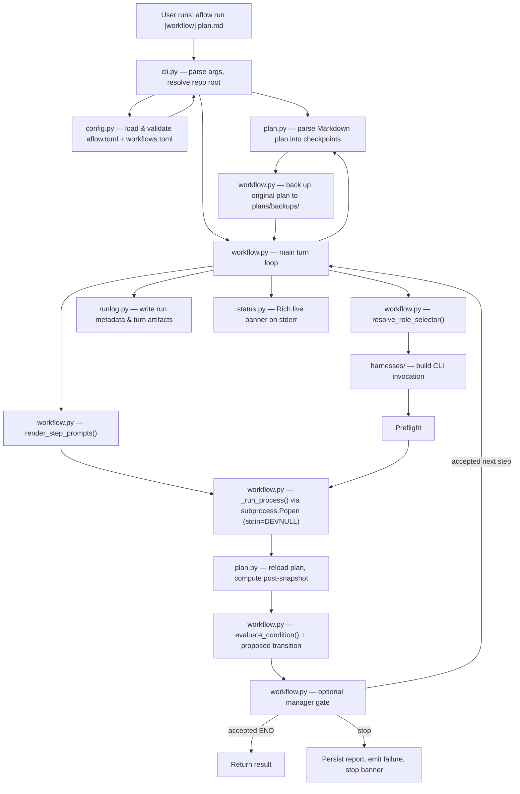

# Architecture

AFlow is a plan-driven workflow orchestrator that runs coding tasks through existing AI agent CLIs (Claude, Codex, Gemini, Kiro, OpenCode, Pi, and Reasonix). It reads a checkpoint-based Markdown plan, dispatches steps to configurable harness profiles, evaluates condition-based transitions between steps, and logs every turn to disk.

`RunMetadataWriter` is the workflow controller's bound schema-v2 persistence boundary, holding stable run identity while each write supplies mutable lifecycle state explicitly.

Standard terminal failures after execution-context resolution use the private
`_WorkflowFailureFinalizer` in `workflow.py` to preserve the failed-metadata,
banner-stop, and `WorkflowError` ordering in one boundary. Startup, preflight,
manager/event-emitting, and merge failures remain explicit because their
additional responsibilities differ.

## High-Level Data Flow


```mermaid
flowchart TD
    User["User runs: aflow run [workflow] plan.md"]
    CLI["cli.py — parse args, resolve repo root"]
    Config["config.py — load & validate aflow.toml + workflows.toml"]
    PlanParse["plan.py — parse Markdown plan into checkpoints"]
    Backup["workflow.py — back up original plan to plans/backups/"]
    WorkflowLoop["workflow.py — main turn loop"]
    PromptRender["workflow.py — render_step_prompts()"]
    Role["workflow.py — resolve_role_selector()"]
    Adapter["harnesses/ — build CLI invocation"]
    Subprocess["workflow.py — _run_process() via subprocess.Popen (stdin=DEVNULL)"]
    PlanReload["plan.py — reload plan, compute post-snapshot"]
    Transition["workflow.py — evaluate_condition() + proposed transition"]
    Manager["workflow.py — optional manager gate"]
    RunLog["runlog.py — write run metadata & turn artifacts"]
    Banner["status.py — Rich live banner on stderr"]

    User --> CLI
    CLI --> Config
    Config --> CLI
    CLI --> PlanParse
    CLI --> WorkflowLoop
    WorkflowLoop --> PlanParse
    PlanParse --> Backup
    Backup --> WorkflowLoop
    WorkflowLoop --> PromptRender
    WorkflowLoop --> Role
    Role --> Adapter
    PromptRender --> Subprocess
    Adapter --> Preflight
    Preflight --> Subprocess
    Subprocess --> PlanReload
    PlanReload --> Transition
    Transition --> Manager
    Manager -->|"accepted next step"| WorkflowLoop
    Manager -->|"accepted END"| Done["Return result"]
    Manager -->|"stop"| Stopped["Persist report, emit failure, stop banner"]
    WorkflowLoop --> RunLog
    WorkflowLoop --> Banner
```

## Harness Environment Preflight

Every real model-backed invocation crosses one shared boundary after the
adapter has resolved its exact argv, working directory, and merged environment,
but before normal turn, manager, recovery, repartition, or lifecycle artifacts
are created. The common OS probe resolves argv[0] with the invocation PATH
and uses a five-second bounded local diagnostic budget. Adapter capabilities are
optional, so build-only custom adapters remain compatible.

The Reasonix adapter uses the resolved executable for doctor --json. Only an
object whose sandbox.bash is exactly enforce causes the adapter to resolve
bwrap; the stable blocker is reasonix_sandbox_bwrap_missing. A missing
primary executable uses the generic harness_executable_missing blocker.
Diagnostics are read-only and secret-safe. Run metadata stores only the
allow-listed reason, harness, invocation kind, logical location, checked
command, fixed remediation, and safe diagnostics. It never stores prompts,
raw argv, environment, doctor output, or absolute executable/configuration
paths.

A blocker is a terminal run-level failure, not a synthetic turn or manager
result. It preserves earlier artifacts and pending routing state, and explicit
resume re-evaluates the pending invocation after the owner remediates the
environment. Injected runners without an explicit probe remain ready by
contract. Authentication, network/provider health, quota, model availability,
arbitrary dependency health, and configuration repair remain outside this
boundary. The guardian remains the fallback for legacy failures and
prerequisites that cannot be verified safely by product preflight.

## Interstep Manager Boundary

After a workflow turn has durable final artifacts, the controller computes its
proposed recovery or transition and optionally invokes the interstep manager
before applying it. This includes a proposed terminal transition: merge and
teardown begin only after the manager accepts that terminal action. Lite gets
compact semantic evidence and structured state, while Full additionally gets
the complete active plan. Manager calls and their exact artifacts live outside
the workflow turn sequence, so they never affect turn counts or checkpoints.
Turn-text diagnostics preserve the stream and structured outcome boundary:
semantic stdout is scanned for text signals, successful zero-return stderr may
be a harness transcript and remains untrusted context, and stderr becomes a
failure diagnostic only for a nonzero return code or a failure-like turn
status. Explicit `AFLOW_STOP` parsing remains independent on both streams.
Durable plan, branch, worktree, boundary, and turn-outcome fields override
contradictory transcript text. Lite keeps active and original plan bodies null
and marks both as intentionally omitted; this redaction is not evidence that a
plan is missing, while Full can include available plan content.
At a clean controller-proposed `END`—a transition without operational failure,
scope pressure, or max-turn terminal handling—Lite eligibility omits `stop`.
An ineligible or invalid Lite response, including `stop`, and an explicit Lite
escalation each lead to one Full decision from the same finalized-turn evidence
with Full eligibility restored. Full `stop` and `stop` at every non-clean
boundary retain the normal failure path. The controller never infers success or
failure from manager `reason`, `stop_report`, or other free text.
Every manager prompt names the configured manager skill and embeds the complete
closed JSON protocol, including the structured stop-report shape. Invalid
manager output at a terminal incident cannot replace the original controller
failure as the report's primary cause.
Manager invocation and note-correction execution is owned by one private,
module-level `_ManagerCallExecutor` with explicit stable dependencies, while
the changing plan and step identities plus the current baseline team remain
per-call inputs. Manager gate policy is owned by one private, frozen, module-level
`_ManagerGateCoordinator` with explicit stable dependencies; original, active,
and new plan paths plus the current baseline team and runtime step identity
remain per-boundary inputs.
The bounded repartition proposal and semantic-validation cycle is owned by one
private, frozen, module-level `_RepartitionCycleExecutor`; original and active
plan paths remain explicit per accepted manager boundary. Its live invocation,
persistence, and application callbacks remain nested, so automatic repartition
stays opt-in. Gate selection, escalation, stop handling, and pending-note policy
now remain inside the coordinator rather than `run_workflow()`.
Manager/status metadata updates preserve the existing lifecycle identity when
they do not carry an execution context, preventing worktree resume fields from
being erased at a later boundary.
After `write_turn_artifacts_start()` succeeds, the controller owns a durable
turn boundary: ordinary catchable exceptions before normal finalization produce
exactly one terminal turn outcome and a failed, resumable run (unless artifact
storage itself fails). The stored exception evidence is bounded and redacted,
and generic exceptions are never retried automatically. A turn already
finalized before an observer or later operation fails is not finalized again.
Resume detects an unfinished durable turn from its `starting` result artifact
and retries that workflow step instead of resetting to the original CLI start
step.
Resume also detects a finalized active turn that is newer than the boundary in
`run.json`. It carries that immutable turn into the new controller, rebuilds
the active repair-plan transition, and executes the missing manager gate
against the source run before starting another harness.
When that finalized worker advanced the original checkpoint and intentionally
removed its completed repair overlay, standard resume may normalize the active
plan back to the original plan before replay. This recovery is permitted only
when the durable turn records a nonterminal worker transition with no new plan
and the saved implementation scope proves that the original checkpoint
advanced; an otherwise missing saved active plan remains a hard failure.
An explicit resume also bypasses the fresh-run Pre-Handoff Base HEAD refresh
gate during startup preparation. Resume candidate validation and the reused
worktree checks remain authoritative, and runtime does not rewrite the started
plan's recorded base merely because the primary checkout advanced meanwhile.
A failed terminal merge is the sole complete-snapshot resume case. It requires
durable `transition_end`, failed merge metadata, and matching merge teardown;
the continuation normalizes to the original plan and retries only terminal
integration, creating no workflow turn or checkpoint harness.
Follow-up plan version discovery runs in the execution checkout. An already
active repair overlay is not reported as newly created, so approval returns the
next checkpoint worker to the original plan while a newly written next-version
overlay remains routable.
Resume also normalizes legacy durable state that captured a completed
checkpoint or checklist-style repair overlay after its original checkpoint
advanced, closing that stale scope before the next worker starts.

Manager transport may select an adapter-native final-response argv without
changing ordinary workflow invocations. Progress analysis keeps whole-run
checkpoint stability separate from scope-aware same-step stalls and reviewer
rejections. Active-scope boundaries persist their opening turn so runtime and
historical analysis use the same controller window. Successful turn artifacts,
in-memory records, and finish events share one finish timestamp and duration.
The decision parser normalizes one exact `json`-tagged Markdown fence around a
single object, while continuing to reject all other transport prose/noise.
It also bounds advisory notes to the first eight after validating their types
and per-note size, avoiding a Full fallback caused only by surplus useful
advice.
For selector-3 contexts, Lite receives bounded controller-owned note scope,
not plan prose: the flat `manager_note_scope` describes the proposed route and
an optional retry scope appears only for a distinct eligible retry route.
Same-plan retry and backup-retry decisions validate against that flat scope
when the duplicate retry field is omitted. File identities remain
case-sensitive, extensionless list entries are either represented or make the
scope incomplete, and direct `plans/...` selection instructions are rejected.
Immutable boundary artifacts retain these facts so context rebuilding does not
read changed plans. Notes remain advisory: exact controller-scope restatement
is the only allowed file authority, while restrictive paraphrases, plan
selection, and worker-mandate language are rejected locally. Before any worker
launch, an invalid persisted note is marked, receives exactly one Full
`pending_notes_invalid` correction, and either has corrected/empty notes made
durable or stops; legacy notes without the marker remain readable.
A current response whose only defect is plan-selection wording receives one
separate correction sub-attempt before decision persistence. The controller
reuses the captured decision number, level, model/profile, eligible actions,
target identity, note scope, boundary, and repository fingerprint; only
`next_step_notes` may change. Both harness responses remain durable under one
decision directory, while history, events, routing, and turn accounting see
one logical decision. Drift, mutation, a changed non-note field, or any second
failure stops at that boundary without Lite escalation or another correction.
Boundary schema versioning preserves the legacy shape for old artifacts while
new boundaries snapshot structured plan state. Resume rebases run-local scope
turn numbering and carries prior rejection progress explicitly. Legacy scopes
without that explicit carried field resume with zero scoped rejections instead
of importing the old run-wide counter.
Implementation upgrades use a stable original-checkpoint review scope rather
than the mutable active repair-plan identity. Attempts retain their actual team
and selector; each rejection can expose one further configured edge. Approval
closes the scope before the next checkpoint and clears scoped pending actions
without deleting historical attempt evidence.
On the first rejection in an open original-checkpoint scope, Lite decides by
cause: it may keep the same worker for a bounded repair, choose the exposed
one-edge upgrade for a capability or convergence failure, or escalate
structural ambiguity or scope pressure to Full. The second rejection in that
same scope invokes Full directly with retrospective evidence.
If Full continues after the upgrade chain is exhausted, the controller
persists a one-turn override for the most recently reviewed worker; closing the
scope on approval is the sole path back to baseline.
Each controller-confirmed rejection is persisted as a bounded
`ReviewRejectionRecord` in `run.json` and in the reviewer turn artifact. The
record identifies the reviewed worker and source run, while the raw reviewer
stdout remains the durable detailed evidence.

## Module Breakdown

### `cli.py`
Entry point. Exposes three subcommands:
- **`aflow run [plan_or_workflow ...] [-- extra instructions]`** -- runs a workflow.
  - Plan path and workflow name are resolved from explicit flags (`--plan`/`-p`, `--workflow`/`-w`) and/or positional arguments.
  - Two positionals are resolved intelligently by file existence and workflow name validity; one positional is always treated as the plan path.
  - `--start-step`/`-ss` accepts either a workflow step name or a 1-based numeric index into the declared workflow step order.
  - `--resume [RUN_ID]` forces resume mode. With no `RUN_ID`, the CLI must resolve a resumable previous run from shell-local state or fail. With `RUN_ID`, the CLI resumes that exact run or fails.
- **`aflow install-skills [destination]`** -- copies bundled skills into harness skill directories.
  - The default install set includes `aflow-harness-recovery-lead` and `aflow-manager`.
  - `--include-optional` adds optional bundled skills such as `aflow-assistant`.
  - `--only` installs exactly the named skill(s).
- **`aflow show [workflow_name]`** -- renders workflow diagrams and the effective role/team relationships from the loaded config.
  - With no workflow name, it prints a shared roles/teams section followed by every workflow in config order.
  - With a workflow name, it prints only that workflow plus the roles and teams that apply to it.
- **`aflow analyze [RUN_ID] [--all] [--manager-context lite|full] [--turn N]`** -- analyzes run logs from `.aflow/runs/`.
  - Single-run mode resolves the target run in `analyzer.py`, and the CLI delegates to `aflow.api.analyze.analyze_runs()` so library callers get the same behavior.
  - Manager-context mode is read-only and uses the same shared context builder as runtime; Lite excludes plan content and Full includes the active plan.

`main()` resolves `aflow run` startup in this order:

1. Parse CLI arguments into explicit flags (`--plan`, `--workflow`, `--start-step`, `--team`, `--max-turns`) and remaining positional tokens.
2. Ensure `~/.config/aflow/aflow.toml` and sibling `workflows.toml` exist. If either file was created, print both paths and exit so the user can edit them first.
3. Load and validate the workflow config.
4. Resolve positional tokens and explicit flags into a canonical plan path and workflow name using these rules:
   - One bare positional means plan path only.
   - Two bare positionals are resolved by checking whether each token is an existing plan file or a configured workflow name. If both resolve uniquely, they are assigned accordingly. If both could match both categories, neither matches both, or both could be plans, the CLI exits with a clear ambiguity error.
   - Positional and flag values for the same field are allowed only if they resolve to the same canonical value; conflicting values cause an error with the specific conflict.
5. Resolve any numeric `--start-step` value to a canonical workflow step name by validating the index against the selected workflow's declared step order. Out-of-range indexes fail with a clear bounds error listing the valid range.
6. Load the original plan strictly.
7. If the plan is complete and `--start-step` was given, fail with a clear error.
8. If the plan is half-done and the workflow has more than one step, require a TTY and prompt for an explicit step unless `--start-step` was given.
9. If strict plan loading fails with `inconsistent_checkpoint_state`, require a TTY and ask whether to recover.
10. When recovery is accepted, load a tolerant snapshot from the invalid plan, seed startup retry state, and pass both the parsed plan and retry context into `run_workflow()`.

`run_workflow()` then establishes plan authority before durable run identity:
it probes repository/bootstrap state, backs up and loads the plan, and
normalizes a missing Git Tracking section only for pristine fresh review plans.
Only after the normalized plan reloads with the same checkpoint snapshot does
the controller reserve a run ID or persist a launch manifest. A ready repository
uses its verified current `HEAD`; an eligible empty-repository lifecycle defers
only that value until the initial commit has been verified. The later runtime
presence check remains a defensive invariant against external mutation.

### `analyzer.py`
Analyzes `.aflow/runs/` artifacts and powers `aflow analyze`.
- Single-run mode resolves the run in this order: explicit `RUN_ID` argument, the current shell's `.aflow/last_run_ids/<shell-id>` entry when available, `AFLOW_LAST_RUN_ID` environment variable, then `.aflow/last_run_id`.
- `--all` switches to corpus mode, which summarizes multiple runs instead of one.
- The bundled assistant skill uses this command as its primary evidence-first entrypoint.

### `config.py`
Loads `~/.config/aflow/aflow.toml` plus sibling `workflows.toml` (bootstrapped from the bundled defaults on first run). Parses and validates:
- **`[aflow]`** section: `default_workflow`, `keep_runs`, `max_turns`, `retry_inconsistent_checkpoint_state`, `banner_files_limit`, `max_same_step_turns`, `team_lead`, `branch_prefix`, `worktree_prefix`, `worktree_root`.
- **`[harness.<name>.profiles.<profile>]`** tables: `model`, optional `effort` per harness profile.
- **`[roles]`** and **`[teams.<name>]`** tables: role-to-selector mappings, with team tables allowed to override a subset of the global map and optionally name a `backup_team` for harness recovery chaining. Nested `prompts` tables provide static per-role system guidance; active-team values replace global values for ordinary workflow turns only.
- **`[manager]`**: optional interstep supervision with Lite and Full role names, a semantic-stall threshold, `skill`, and the read-only `repartition_skill`. `upgrade_to` on a team is a separate one-edge implementation-quality route; both it and `backup_team` are acyclic validated team graphs.
- **`[error_handling.harness_error_recovery]`**: ordered recovery rules, `max_consecutive_recoveries`, and the bundled fallback skill name used when deterministic matching cannot decide safely.
- **`[prompts]`** section: named prompt templates.
- Bare **`[workflow]`** table in `workflows.toml`: lifecycle defaults (`setup`, `teardown`, `main_branch`, `merge_prompt`) inherited by all workflows that don't override them. Not a runnable workflow.
- **`[workflow.<name>]`** tables in `workflows.toml`: concrete workflows define `steps`, alias workflows use `extends` and optional `team`. Both may override lifecycle defaults with `setup`, `teardown`, `main_branch`, and `merge_prompt`.
- Concrete and alias workflows may also set `exclude = ["step_name"]` to remove declared steps from the executable graph while keeping them visible to `aflow show` and the live banner. Alias exclusions are applied after inheritance.
- **`[workflow.<name>.steps.<step>]`** tables: `role` (global role key), `prompts` (list of prompt keys), `go` (transition array with `to` and optional `when` condition).

Lifecycle validation enforces that `(setup, teardown)` is one of three accepted tuples: `([], [])`, `(["branch"], ["merge"])`, or `(["worktree", "branch"], ["merge", "rm_worktree"])`. Any other combination is rejected at load time with the exact workflow path.

When a workflow's effective `teardown` includes `merge`, validation also checks that `[aflow].team_lead` is set and, for config-defined teams, that the role can be resolved through team overrides or global `[roles]`.

Cross-validates that harness profiles, roles, teams, prompts, aliases, and transition targets all reference things that exist.

### `plan.py`
Parses a Markdown plan file into structured checkpoint data. Expects `### [x] Checkpoint ...` headings (h3 with checkbox) and `- [ ] step` items underneath. Produces a `PlanSnapshot` with:
- `current_checkpoint_name`, `current_checkpoint_index`
- `unchecked_checkpoint_count`, `current_checkpoint_unchecked_step_count`
- `is_complete` (all checkpoints checked)
- `total_checkpoint_count`

Also detects `## Git Tracking` sections required by review skills.

### `workflow.py`
The core engine. `run_workflow()` executes the turn loop:

1. Probe repository state, validate lifecycle-bootstrap eligibility, back up and load the original plan, and normalize required Git Tracking metadata before reserving a run ID or writing a launch manifest.
2. For a pristine fresh review plan with no live Git Tracking section, insert the exact two controller-owned fields atomically and reload the plan. Existing sections are never rebuilt. Started, resumed, recovery, malformed, ambiguous, and no-HEAD/non-bootstrap inputs fail before allocation.
3. If the workflow's `setup` is non-empty, inspect the repo state at `repo_root`. If no `.git/` directory exists or the repo has no commits, auto-bootstrap runs before lifecycle preflight: `run_workflow()` probes the repo state via `probe_repo_state()`, determines that bootstrap is needed, runs git-independent preflight (plan path existence, worktree root, `main_branch` config), then invokes the team-lead bootstrap handoff. The handoff resolves `[aflow].team_lead` exactly as merge teardown does, constructs a `README.md` title and body from the plan preamble via `derive_readme_content()`, and runs the agent from the primary checkout using the built-in `aflow-init-repo` skill instruction. After the agent returns, the engine verifies: `HEAD` resolves to a commit, `HEAD` is on `main_branch`, `README.md` exists and is tracked, and the working tree has no tracked-file dirtiness. A deferred empty Git Tracking base is then filled with that exact verified commit, while `Plan Branch` is filled from the lifecycle execution context, before the first ordinary prompt. Existing pristine sections with an empty or stale base are refreshed automatically to the verified current `HEAD`; there is no interactive base-refresh confirmation. Only after bootstrap verification passes does `run_workflow()` continue into the git-dependent phase of lifecycle preflight. For already-committed repos, bootstrap is skipped entirely and the original behavior is preserved. If git is missing, lifecycle workflows fail early with a clear bootstrap error. Preflight validates: branch name collision, worktree path collision, correct startup branch, that `main_branch` points to a local commit, and (for worktree workflows only) that any dirty files in the primary checkout are confined to `plans/` (untracked or gitignored plan files are allowed). For non-worktree workflows, the working tree must be clean. Branch-only setup creates a local feature branch from `main_branch` in the primary checkout. Worktree setup creates a linked worktree from `main_branch` under `worktree_root` and creates the feature branch inside that worktree. The primary checkout remains the control root for run artifacts; the worktree is the execution root for normal steps.

Worktree startup also excludes aflow-owned `.aflow` runtime state from this
dirtiness decision. Ownership matches only the exact repository-relative
`.aflow` root and descendants; deceptive names such as `.aflow-copy` and nested
`src/.aflow` paths remain unrelated dirt. Merge teardown reuses the same
classifier while retaining its backup-plan and active-plan allowances.
4. For each turn (up to `max_turns`):
   a. Reload the plan from disk (the agent may have modified it). For worktree flows, plan path placeholders (`{ORIGINAL_PLAN_PATH}`, `{ACTIVE_PLAN_PATH}`, `{NEW_PLAN_PATH}`) are translated from primary-root-relative to worktree-root-relative before being handed to the agent; they are translated back after the turn.
   b. For worktree flows, sync the original plan into the worktree before rendering prompts (so untracked plans under `plans/` are available for the agent to read and modify).
   c. Resolve the step's role through the selected team and global role map to get the concrete harness selector.
   d. Render prompt templates with path placeholders.
   e. Build a `HarnessInvocation` via the adapter, using `execution_repo_root` as the subprocess cwd.
   f. Run the agent CLI as a subprocess, streaming stdout/stderr. Process-creation `OSError`s are converted into bounded nonzero results (127 for a missing executable, 126 for other launch failures) before this normal harness-result path continues, so the controller can finalize its existing artifacts and terminal metadata.
   g. For worktree flows, sync the original plan back from the worktree to the primary checkout immediately after the harness returns (before parsing post-turn state). This ensures the primary copy reflects any edits the harness made, even if the harness exited with non-zero status.
   h. Before reloading the plan, scan stdout and stderr for a line starting with `AFLOW_STOP:`. If found, fail the run immediately with the extracted reason without entering the plan-reload or transition path.
   i. Reload the plan again to get the post-turn snapshot. If the plan is left in an inconsistent checkpoint state (heading marked complete but unchecked steps remain) and the harness exited cleanly, a retry may be scheduled instead of failing immediately (see `retry_inconsistent_checkpoint_state`).
   j. Evaluate `go` transitions using condition symbols (`DONE`, `NEW_PLAN_EXISTS`, `MAX_TURNS_REACHED`).
   k. Finalize turn artifacts with the active plan that rendered the current
      prompt, then select the next active plan: a newly created plan wins;
      otherwise `preserve_active_plan = true` retains the current plan; all
      other transitions reset to the original plan. Worktree checks use the
      execution path while persisted controller state uses the primary-checkout
      logical path.
   l. Update run metadata with the active plan selected for the next turn.
   m. With manager supervision enabled, persist immutable boundary input beside the finalized artifacts, then build a versioned context and invoke Lite or Full before applying the proposed action, including `END`. The Full manager is read-only: the manager has a closed decision set and cannot alter source, plans, git, config, or run control files; execution-checkout and current-run fingerprints detect mutation. Its own invocation does not count as a workflow turn.
   n. Persist accepted one-hop notes, exact selector, target active-plan identity, stable implementation-scope identity, and an eligible implementation-team override before the next step begins. Resume restores the scope and an unconsumed target before launching it, normalizes attempt histories to mutable live lists, and marks the boundary consumed only after its `starting` artifact is durable. Same-step caps select one direct Full terminal boundary rather than a normal Lite transition followed by Full.
   o. Treat `END` as successful only when the post-turn original-plan snapshot
      is complete. An incomplete max-turn or ordinary `END` records the chosen
      transition but fails without a successful `end_reason`.

   Harness error recovery is inserted after the harness returns and before normal transition handling. If the turn made no plan progress and a configured error-handling rule matches the harness output, the engine produces that cheap deterministic action for manager acceptance. Rules can keep the same team, switch to a configured `backup_team`, or fail immediately. An unmatched ambiguous error goes directly to Full supervision when enabled; manager-disabled runs retain the team-lead recovery handoff. Progress-gated turns skip recovery entirely and continue on the normal transition path.
5. After normal workflow completion, and only after the original-plan snapshot is
   complete, if `teardown` includes `merge`, execute the merge handoff: resolve `[aflow].team_lead` through the effective team, build a merge prompt (built-in `aflow-merge` instruction plus rendered `merge_prompt` entries), and run the `team_lead` agent from the primary checkout. After the agent returns, verify: no unmerged index entries, clean working tree, HEAD on `main_branch`, and feature branch is an ancestor of the target. Only after all checks pass does `rm_worktree` (if configured) remove the linked worktree. Any verification failure leaves the feature branch and worktree intact and fails the run with the specific failed check. An incomplete `END` never enters merge teardown and preserves its branch/worktree identity for explicit resume.
6. `aflow` can resume an unfinished prior run in every accepted lifecycle mode, but only from complete schema-v2 `run.json` authority. Resume candidate lookup resolves the previous run id through the current shell's `.aflow/last_run_ids/<shell-id>` entry when it can detect one, then `AFLOW_LAST_RUN_ID`, then `.aflow/last_run_id`, unless `--resume RUN_ID` supplied an explicit run id. A run is resumable only when its lifecycle-specific identity is complete (no Git identity for no-lifecycle, main/feature branches for branch-only, and the registered path for linked-worktree runs), status is `failed` or `running`, `last_snapshot.is_complete != true`, no `merge_status` exists, and the resolved invocation still matches on repo root, workflow name, authoritative original plan path, effective team, selected start step, max turns, extra instructions, and lifecycle setup. Plain `aflow run` treats that as an optional interactive prompt in TTY mode and otherwise falls back to the fresh-run path. `aflow run --resume` makes resume mandatory: with no run id it must resolve a prior run from that lookup order or fail; with a run id it must use that run or fail. Missing, old, malformed, or future schemas remain readable for inspection but are rejected before plan lookup, startup questions, allocation, or daemon continuation and are never migrated. Accepted resume builds a `ResumeContext` from the durable lifecycle identity and active logical plan path, validates the primary branch or linked worktree when present, and starts `run_workflow()` directly in the reused execution context instead of provisioning a fresh one. The plan file on disk still remains the durable checkpoint state. Resume recomputes the active scope's rejection count from durable review artifacts so corrected classifiers repair older metadata. If a completed active turn is newer than `run.json.turns_completed`, its finalized result becomes a pending replay boundary: the new run uses the source artifacts for one manager decision before routing another harness. Pending repartition stages, hotplug state, and both plan copies are validated and reconciled before any harness starts; an already applied copy is not replayed. An explicit `--resume RUN_ID --resume-reset-scope` manual boundary remains available for owner-directed replacement and preserves lifecycle identity and manager history while omitting the saved active overlay and clearing the live scope/attempt index; the linked source run retains the immutable attempt audit.

### `repartition.py`

Captures the complete original-plan and current-checkpoint bytes in a versioned,
content-addressed scope envelope before the first worker attempt. It records
zero-based byte spans, one-based half-open line spans, exact source blocks, and
SHA-256 identities; summaries are non-authoritative and cannot establish
coverage.

Automatic repartition is a four-boundary protocol:

1. Full selects `repartition_current_checkpoint` only when the controller
   exposes it for a valid live scope.
2. The configured Full role returns a strict read-only proposal covering every
   authoritative and corrective-evidence block.
3. The controller renders the candidate and proves mechanical conservation,
   then a separate Full call validates semantic preservation.
4. The controller alone applies accepted bytes with atomic per-file replacement
   and a durable multi-copy transaction.

Each attempt stores the envelope, boundary source, evidence, prompts,
stdout/stderr, proposal, candidate, mechanical result, semantic verdict, hashes,
and final result under the manager decision's repartition directory. `run.json`
stores the pending stage, identities, disposition, paths, and applied record.
Resume reconciles a partial transaction before another harness. The first child
retains the parent scope and may retain its last worker for
`implement_current_partition`; approval closes it, and the next inserted child
opens a fresh scope on the baseline team.

Mechanical conservation cannot prove semantic equivalence. The independent Full
verdict handles that unavoidable boundary, and two rejected candidates stop
safely with all work and evidence preserved. Every resumed active scope must
carry a complete envelope reference; incomplete historical scopes are readable
for analysis but cannot be resumed or repartitioned. Manager-disabled workflows keep their
existing behavior; a real scope-pressure marker fails clearly rather than being
ignored. `AFLOW_STOP` remains terminal.

A scheduled retry skips the pre-turn plan reload and reuses the last valid snapshot and saved prompt context. The same `ACTIVE_PLAN_PATH`, `NEW_PLAN_PATH`, and resolved step selector are reused; the retry appendix (containing the exact parse error) is added to the prompt. Startup recovery seeds that same retry machinery by passing a `RetryContext` into `run_workflow()`, which stores the step name, role, resolved selector, and prompt context in `state.pending_retry` before turn 1. Retry turns still count toward `max_turns`.

The condition evaluator is a full recursive-descent parser supporting `&&`, `||`, `!`, and parentheses over the three condition symbols.

Prompt templates support `file://` references (absolute, config-relative, or cwd-relative).

### `harnesses/`
Adapter layer. Each harness implements `HarnessAdapter.build_invocation()` to produce a `HarnessInvocation` (argv, env, prompt texts). Eight adapters:

| Harness    | CLI binary  | Prompt mode                    | Effort support |
|------------|-------------|--------------------------------|----------------|
| `claude`   | `claude`    | `--system-prompt` flag         | Yes            |
| `codex`    | `codex`     | stdin via `exec -`              | Yes          |
| `copilot`  | `copilot`   | system prefixed into user prompt | Yes          |
| `gemini`   | `gemini`    | system prefixed into user prompt | No           |
| `kiro`     | `kiro-cli`  | system prefixed into user prompt | No           |
| `opencode` | `opencode`  | system prefixed into user prompt | No           |
| `reasonix` | `reasonix`  | system prefixed into user prompt | No           |
| `pi`       | `pi`        | `--system-prompt` flag         | Yes            |

All harnesses run in non-interactive, auto-approve mode with full tool access.
Their effective prompts are delivered through argv or explicit prompt flags, so
`workflow._run_process()` starts real children with `stdin=subprocess.DEVNULL`.
This leaves the controller/dashboard as the sole owner of interactive terminal
input while preserving the existing stdout/stderr pipes, return codes, and
prompt metadata. Injected runner callables are unchanged.

Reasonix owned sessions use a stricter ACP boundary. The driver owns one stdio
process through initialize, session creation or exact resume, configuration,
prompt, and close. Before prompting it must negotiate the exact
`tool_approval=yolo` select value, then model and effort, consuming a complete
`configOptions` acknowledgement after every update and rechecking all applied
values. Any missing, malformed, rejected, or reset state closes the process and
terminalizes the run before the prompt. A permissive global Reasonix permissions
file is not AFlow's proof that an owned ACP session is noninteractive.

Codex uses the documented `codex exec ... -` form: the complete effective
prompt is sent through stdin and is never added to argv. The subprocess
boundary drains stdout and stderr while feeding stdin, and the equivalent
injected-runner boundary supplies the same `input` value. If process creation
raises `OSError`, either boundary returns an empty-output, prompt-free
`CompletedProcess` with a concise harness/errno/OS-message diagnostic; missing
executables use return code 127 and other launch failures use 126. Manager,
worker, recovery, and lifecycle callers then use their existing nonzero-result
handling.

### `run_state.py`
Data classes for runtime state:
- `ControllerConfig` -- immutable run parameters (repo root, plan path, max turns, keep runs, extra instructions).
- `ControllerState` -- mutable per-run state (snapshot, turn count, issues, timing, status, pending retry context, consecutive same-step streak tracking, frozen configuration identity, effective turn limit, and safe override result).
  - Also carries the current run id and, for resumed runs, the source run id so the banner and startup output can surface both immediately.
- `FrozenRunIdentity` -- selected workflow name, resolved configuration path, and a canonical SHA-256 fingerprint computed once from the resolved in-memory execution configuration.
- `OverrideRequest` / `OverrideResult` -- the strict user request and durable controller decision for one `overrides.toml` content digest. Raw notes stay out of broad status output.
- `ResumeOverrideResolution` -- the selected predecessor's persisted result plus actual-file classification for the successor's first boundary. It uses the normal override loader and never scans other runs.
- `RetryContext` -- frozen dataclass holding everything needed to rerun the same step on the next turn without re-parsing the broken plan (step name, role, resolved selector, pre-failure snapshot, saved plan paths, base prompt, parse error string, attempt counter, retry limit).
- `ExecutionContext` -- frozen dataclass holding lifecycle execution state: `primary_repo_root`, `execution_repo_root` (worktree path for worktree flows, same as primary for branch-only), `main_branch`, `feature_branch`, `worktree_path` (or `None` for branch-only), `setup`, `teardown`.
- `ControllerConfig` also carries the selected startup step, if any, so the workflow loop can start from a non-default step without re-parsing CLI arguments.
- `ControllerRunResult` -- final result with end reason.
- `WorkflowEndReason` -- literal type: `already_complete`, `done`, `max_turns_reached`, `transition_end`.

### `runlog.py`
Persists run data under `.aflow/runs/<timestamp>-<uuid>/`:
- `run.json` -- schema-versioned controller metadata, atomically replaced before externally visible launches and after finalized boundaries.
- `overrides.toml` -- optional user-owned request surface read exactly once at a pre-turn boundary. Its only keys are `next_step`, `team`, `max_turns`, and `notes`; AFlow records but never rewrites or deletes it.
- `turns/turn-NNN/` -- per-turn artifacts: `system-prompt.txt`, `user-prompt.txt`, `effective-prompt.txt`, `argv.json`, `env.json`, `stdout.txt`, `stderr.txt`, `result.json`.
- `create_run_paths()` also writes `.aflow/last_run_id` immediately after the run directory is created, and writes `.aflow/last_run_ids/<shell-id>` when a stable shell/session id is available, so later `aflow analyze` invocations can prefer shell-local state without losing the repo-wide fallback if the workflow fails mid-run.

`run.json` is written through a sibling temporary file, flushed and fsynced,
then replaced in the same directory. The resolved workflow/config fingerprint
is frozen at startup; runtime never reloads global TOML. Accepted override
digests are durable before routing changes, rejected digests produce
`waiting_for_valid_override`, and corrected content can be retried on resume.
Direct `run.json` editing, graph mutation, active-harness mutation, and
lifecycle/manager/plan-lineage overrides are intentionally unsupported.

Every resume still creates a distinct durable run id linked through
`resumed_from_run_id`; lifecycle identity and the reused worktree do not change.
Before that successor launches its first harness, resume classifies only the
explicitly selected predecessor's `overrides.toml` against the predecessor's
durable result. A new, changed, rejected, or accepted-but-unapplied request owns
that first boundary. Acceptance/rejection is atomically durable before routing;
successful application releases cross-run ownership, so later boundaries read
the successor's own file. An unchanged accepted digest is already consumed.
Rejected state remains a hard gate when the required selected-predecessor file
is missing or unreadable.

Prunes old run directories to respect `keep_runs`.

### `git_status.py`
Git snapshot helpers used by the banner and CLI. Provides three public data classes (`GitBaseline`, `GitSummary`, `WorktreeProbe`) and three functions:
- `probe_worktree(repo_root)` — checks whether the working tree is dirty at startup.
- `capture_baseline(repo_root)` — snapshots the current HEAD SHA and a working-tree tree OID (using a temporary `GIT_INDEX_FILE`) as a before-run baseline.
- `summarize_since_baseline(repo_root, baseline)` — compares the current working tree against the baseline and returns file-change counts, net line deltas, commit count, and changed paths.

All three functions return `None` when git is unavailable or fails, so the workflow always runs regardless of git state.

### `status.py`
Rich-based live banner rendered to stderr during a run. The live dashboard is
a borderless, deterministic single-column document ordered as the plan title,
current-scope review history, chronological turns, workflow graph, and summary
status. It shows elapsed time, run id, resumed-from run id when present,
workflow/step name, harness, model, checkpoint progress, turn count, issues,
plan paths, git summary (if available), schema/frozen-config identity, safe
override diagnostics, and status.
When the active implementation scope has rejected reviews, it also shows every
current-scope rejection before the chronological turn cards and labels the next
worker as a re-implementation with its compact rejection reason.
Workflow steps carry explicit plain-text active, inactive, excluded, or skipped
labels; color is only additional reinforcement. Controller-owned values use
literal `Text` renderables so Rich markup-like content remains unchanged. The
module also owns the shared workflow-graph classification helpers used by both
the live banner and `aflow show`; only the live branch is flattened, while
`build_workflow_show()` retains its panel-based presentation.

`BannerRenderer` owns a background daemon thread that waits for the first
`refresh_interval_seconds` deadline and then performs one explicit
`Live.update(..., refresh=False)` plus `Live.refresh()` per periodic repaint
(default 3 s). Rich automatic refresh is disabled, and ordinary
`update(...)`/`set_context(...)` calls only replace the newest state/context
for the next tick. Git collection remains independently due every
`git_poll_interval_seconds` (default 10 s), while lifecycle paints are kept
explicit and bounded so manager reports can follow the stopped banner. Input
wakes are drained within the same scheduler cycle, before due Git collection,
so continuous navigation cannot starve Git and coincident work causes one
repaint.
On a supported POSIX TTY, `BannerRenderer` also creates one
`TerminalInputSession` and one `ScrollableViewport`. The session owns cbreak
input and a bounded `select()` reader, but only enqueues decoded navigation or
resize work; the render thread applies all queued work and is the only
background caller of `Live.update()`/`Live.refresh()`. Interactive `Live`
instances use `screen=True`, `auto_refresh=False`, and cropped viewport output;
all other consoles retain the borderless, non-interactive fallback. `k`/Up,
`j`/Down, `b`/PageUp, `f`/Space/PageDown, `g`/Home, and `G`/End provide
line/page/top/bottom navigation, with bottom restoring follow-tail. Pause and
stop join the input and render threads, stop `Live`, restore terminal
attributes, and then print one full borderless snapshot to normal scrollback
only when alternate-screen mode was active. Background renderer failures and
interpreter exit use the same idempotent renderer-owned cleanup, including
Rich cursor/alternate-screen restoration and the session's termios restore.
During a live run, real harness children receive closed stdin because every
configured adapter already places its effective prompt in argv or a CLI flag;
the dashboard/controller therefore has exclusive ownership of terminal input.

### `skill_installer.py`
Discovers the thirteen default bundled skills plus the optional bundled skills from package resources, and copies the selected set into harness-specific skill directories. `BUNDLED_SKILL_NAMES` is the full sorted inventory of valid bundled skill names, while `DEFAULT_BUNDLED_SKILL_NAMES` and `OPTIONAL_BUNDLED_SKILL_NAMES` preserve install behavior. The default inventory includes `aflow-harness-recovery-lead`, the same-task `aflow-guard-development-run`, and `material-code-review`. Supports auto-detection (looks for harness CLIs on PATH) and manual mode (explicit destination path). Handles duplicate destinations when multiple harnesses share a path (e.g., codex, copilot, gemini, and pi all use `~/.agents/skills`).

### `bundled_skills/`
Thirteen default skill definitions plus one optional shipped skill installed into harness skill directories:

| Skill                       | Purpose                                                        |
|-----------------------------|----------------------------------------------------------------|
| `aflow-plan`                | Create a checkpoint handoff plan                               |
| `aflow-execute-plan`        | Execute an entire plan autonomously, checkpoint by checkpoint  |
| `aflow-execute-checkpoint`  | Execute exactly one checkpoint, then stop                      |
| `aflow-review-squash`       | Review completed work; approve+squash or create fix plan       |
| `aflow-review-checkpoint`   | Review one checkpoint; approve or create fix plan              |
| `aflow-review-final`        | Final review without squash; approve or create follow-up plan  |
| `aflow-merge`               | Local-only merge handoff; preserves commits, resolves conflicts, emits `AFLOW_STOP:` for irrecoverable states |
| `aflow-init-repo`           | Pre-lifecycle bootstrap; initializes a local repo and creates the initial commit from the plan preamble       |
| `aflow-harness-recovery-lead` | Team-lead fallback for harness recovery; returns a strict machine-readable recovery decision |
| `aflow-manager`             | Read-only Lite/Full interstep supervision                    |
| `aflow-repartition-checkpoint` | Scope-preserving checkpoint split proposal and validation  |
| `aflow-guard-development-run` | Same-task heartbeat guard for one exact AFlow run           |
| `material-code-review`      | Material-defect admission gate and proportionate review fixes |
| `aflow-assistant`           | Optional evidence-first debugging and setup helper              |

### `api/`
Public library API for startup preparation and workflow execution. Re-exported from `aflow/__init__.py` for stable imports.

**Run analysis (`analyze.py`):**
- `AnalyzeRequest` -- immutable request parameters for public run analysis. Supports single-run mode via `run_id` and corpus mode via `all=True`.
- `analyze_runs(request: AnalyzeRequest) -> dict[str, object]` -- shared helper used by both the CLI and library callers. It mirrors `aflow analyze` resolution and output shape.

**Startup preparation (`startup.py`):**
- `prepare_startup(request: StartupRequest) -> PreparedRun | StartupQuestion` — Main entry point for startup preparation. Returns either a `PreparedRun` (ready to execute) or a `StartupQuestion` (needs user input).
- `prepare_startup_with_answer(request: StartupRequest, answer: str) -> PreparedRun | StartupQuestion` — Resume startup preparation after answering a question.
- `StartupError` — Raised when startup preparation encounters an unrecoverable error.

Startup models (`models.py`):
- `StartupRequest` — Immutable request parameters for startup preparation.
- `StartupContext` — Immutable startup state loaded from config and environment.
- `StartupQuestion` — Structured question requiring user input for step selection, dirty-worktree confirmation, or startup recovery. Base-HEAD refresh is automatic and has no question kind.
- `StartupQuestionKind` — Enum of possible question kinds.
- `PreparedRun` — Immutable result of successful startup preparation. Contains `StartupContext`, parsed plan, and resolved parameters for `execute_workflow()`.

**Workflow execution (`runner.py`):**
- `execute_workflow(prepared_run: PreparedRun) -> ControllerRunResult` — Convenience function that executes a prepared workflow with default configuration.
- `WorkflowRunner` — Configurable runner class for executing prepared workflows with custom observers, banner renderers, harness adapters, or subprocess runners.
- `RunnerConfig` — Configuration dataclass for `WorkflowRunner`. Accepts `PreparedRun`, optional `ExecutionObserver`, optional `BannerRenderer`, optional `HarnessAdapter`, and optional subprocess runner callable.

**Execution events (`events.py`):**
- `ExecutionObserver` — Protocol for observing workflow execution events. Subclasses implement `on_event(event: ExecutionEvent) -> None`.
- `CallbackObserver` — Observer implementation that calls a user-provided function for each event.
- `CollectingObserver` — Observer implementation that collects all events into a list for later inspection.
- `ExecutionEvent` — Base class for all execution events.
- `ExecutionEventType` — Enum of event types: `RUN_STARTED`, `STATUS_CHANGED`, `TURN_STARTED`, `TURN_FINISHED`, `QUESTION_REQUIRED`, `RUN_COMPLETED`, `RUN_FAILED`.
- `RunStartedEvent` — Emitted when a workflow run starts.
- `StatusChangedEvent` — Emitted when the workflow status changes.
- `TurnStartedEvent` — Emitted when a workflow turn starts.
- `TurnFinishedEvent` — Emitted when a workflow turn finishes.
- `QuestionRequiredEvent` — Emitted when a workflow step requires a question (currently unused in library context but included for completeness).
- `RunCompletedEvent` — Emitted when a workflow run completes successfully.
- `RunFailedEvent` — Emitted when a workflow run fails.

**CLI-as-adapter boundary:**
- `cli.py` consumes the public `aflow.api` surface for startup preparation and workflow execution.
- Terminal rendering in `cli.py` and `status.py` is implemented as an `ExecutionObserver` over structured library events.
- CLI-specific behavior (TTY-only prompts, Rich banner rendering, exit codes) lives entirely in `cli.py`, while startup decisions, execution state, and plan mutations are owned by the library.
- Non-CLI callers can import from `aflow` or `aflow.api` directly and use the same startup and runner APIs without invoking `aflow.cli.main()` or requiring terminal access.

## Workflow Configuration

Workflows are state machines defined in `workflows.toml`. Each step has:
- A `role` key that resolves through the selected team and then global `[roles]`.
- A `prompts` list referencing named prompt templates.
- A `go` array of transitions, each with a `to` target (step name or `END`) and an optional `when` condition expression.

Workflow tables can also use `extends` to alias a concrete base workflow and `team` to override the team for that alias. In v1, aliases inherit the base workflow's steps and cannot redefine them.

Bare `[workflow]` in `workflows.toml` is a lifecycle defaults table. It supplies `setup`, `teardown`, `main_branch`, and `merge_prompt` values that all concrete workflows and aliases inherit unless they override them individually. It is not a runnable workflow.

Lifecycle config controls the git environment created before workflow steps begin and torn down after normal completion. The accepted `(setup, teardown)` pairs are:
- `([], [])` — no lifecycle, engine behaves exactly as before
- `(["branch"], ["merge"])` — create a local feature branch, run steps there, then invoke merge handoff
- `(["worktree", "branch"], ["merge", "rm_worktree"])` — create a linked worktree from `main_branch`, run steps in that worktree, invoke merge handoff from the primary checkout, then remove the worktree after verified merge

Merge is model-driven through the `aflow-merge` skill. The engine resolves the `team_lead` role, prepends the built-in `aflow-merge` instruction, appends rendered `merge_prompt` entries, and runs the agent from the primary checkout. After the agent returns, the engine verifies merge success before removing any worktree.

Transitions are evaluated top-to-bottom; the first match wins. An entry without `when` is an unconditional fallback.

The built-in workflow diagrams live in the README so the default workflow shapes are visible in the main docs without sending readers into the architecture reference first.

## Directory Layout

```
aflow/
  __main__.py          # entrypoint
  __init__.py          # public API re-exports
  cli.py               # argument parsing, main(), dirty-worktree gate
  config.py            # TOML config loading and validation
  plan.py              # Markdown plan parser
  workflow.py          # workflow engine (turn loop, conditions, transitions)
  api/
    __init__.py        # public API exports
    startup.py         # startup preparation functions
    models.py          # startup and execution models
    runner.py          # workflow execution runner
    events.py          # execution events and observers
  run_state.py         # runtime data classes
  repartition.py       # immutable envelopes, strict split protocol, validation
  runlog.py            # run/turn artifact persistence
  status.py            # Rich live banner with AFlow-owned refresh thread
  git_status.py        # git snapshot helpers (probe, baseline, summary)
  skill_installer.py   # bundled skill installer
  aflow.toml           # global config, harness profiles, roles, teams, prompts
  workflows.toml       # workflow definitions and aliases
  harnesses/
    __init__.py        # adapter registry (ADAPTERS dict)
    base.py            # HarnessAdapter protocol, HarnessInvocation dataclass
    claude.py          # Claude Code adapter
    codex.py           # Codex adapter
    copilot.py         # Copilot adapter
    gemini.py          # Gemini adapter
    kiro.py            # Kiro adapter
    opencode.py        # OpenCode adapter
    pi.py              # Pi adapter
    reasonix.py        # Reasonix adapter
  bundled_skills/
    aflow-plan/              SKILL.md
    aflow-execute-plan/      SKILL.md
    aflow-execute-checkpoint/ SKILL.md
    aflow-review-squash/     SKILL.md
    aflow-review-checkpoint/ SKILL.md
    aflow-review-final/      SKILL.md
    aflow-merge/             SKILL.md
    aflow-guard-development-run/
      SKILL.md
      agents/                openai.yaml
      references/            aflow-defect-plan.md
      scripts/               aflow_guard_snapshot.py
tests/
  test_aflow.py        # workflow engine tests
  test_skill_install.py # skill installer tests
plans/                 # user plan files and backups
  backups/             # automatic plan backups
  in-progress/         # active handoff plans
apps/                  # separate subprojects (not in published wheel)
  aflow_app/           # remote management app
    server/            # FastAPI backend using aflow library
    web/               # React frontend
.aflow/
  runs/                # per-run logs (gitignored)
```

## Key Design Decisions

- **Plan as source of truth.** The Markdown plan file on disk is authoritative. The engine re-reads it before and after every turn because the agent subprocess may modify it (checking off steps/checkpoints).
- **Harness-agnostic.** The engine doesn't know how any specific agent CLI works. Adapters translate a uniform interface into CLI-specific argv/env. Adding a new harness means one ~30-line adapter file.
- **Library-first architecture.** All startup preparation and workflow execution logic lives in the `aflow.api` public surface. The CLI is a thin terminal adapter that renders library-provided questions and events for interactive use. Non-CLI callers can import and use the same library APIs without terminal access or Rich dependencies.
- **Interactive startup decisions are structured.** Startup decisions that require human input are represented as `StartupQuestion` objects with a `kind` enum, prompt text, and metadata. The CLI renders these as TTY prompts; library callers can present them in any UI or handle them programmatically via `prepare_startup_with_answer()`.
- **Condition-based transitions.** Step transitions use a small expression language over three boolean symbols rather than hardcoded control flow. This keeps workflow definitions declarative.
- **Structured run logging.** Every turn's prompts, outputs, and snapshots are persisted to `.aflow/runs/` for debugging and auditability. Old runs are pruned automatically.
- **Skills as Markdown.** The bundled skills are plain SKILL.md files that get copied into each harness's skill directory. The default set stays separate from the optional `aflow-assistant` helper. They contain behavioral instructions that the agent reads at runtime, not executable code.
- **Local-only lifecycle.** Branch and worktree creation, feature branch setup, and merge handoff all operate on local refs only. The engine never fetches, pulls, or pushes. The primary checkout is the control root for run artifacts and merge verification even when normal steps execute inside a linked worktree.


## Remote App (Separate Subproject)

The `apps/aflow_app/` directory contains a mobile-first remote management
application that imports `aflow` as a library. It is not included in the
published `aworkflow` wheel.

### Server (`apps/aflow_app/server/`)

The Python 3.12+ FastAPI server owns project identity, plan drafts, workflow
execution, and the application-facing planning-session API. Its main boundaries
are:

- `main.py` owns application-lifespan state: configuration, the project
  catalog, one long-lived planning provider registry, the planning service, and
  the shared attachment store.
- `project_catalog.py` discovers local projects and associates provider
  sessions by current working directory and stored historical aliases. Project
  paths remain server-authoritative.
- `planning/models.py`, `provider.py`, `registry.py`, and `service.py`
  define the provider-neutral session, capability, error, lifecycle, and
  operation contracts. Session identity is always the pair
  `(provider_id, provider_session_id)`.
- `planning_routes.py` exposes provider discovery and project-scoped session
  routes under
  `/api/projects/{project_id}/planning/providers/{provider_id}/sessions`.
  The same router retains the existing project plan-draft URLs, which are not
  provider operations.
- `planning/providers/codex.py` is the concrete Codex adapter. It uses the
  public `codex-app-server-sdk` API for session lifecycle, turns, model
  discovery, archive state, approvals, and interruption. Codex protocol models
  and errors are normalized before they reach the app boundary.
- `planning/attachment_store.py` stores uploaded bytes beneath shared
  aflow-managed configuration storage, outside project repositories. It
  validates provider-qualified namespaces, limits, containment, and in-flight
  leases. The Codex adapter supplies staged file/image metadata to turns through
  deterministic prompt augmentation because the SDK helpers do not provide
  equivalent native rich-attachment input.

Provider capabilities drive available models, reasoning values, attachment
kinds, and optional operations. A provider failure is reported through bounded,
provider-neutral readiness/error models and does not suppress healthy providers.
The default execution policy is configured server-side as full access; it is
not selected by browser requests.

The server also provides repository/project discovery, plan persistence,
workflow execution through `aflow.api`, SSE execution events, token
authentication, and optional audio transcription. Configuration is loaded from
environment variables and `~/.config/aflow/config.toml`.

### Web Client (`apps/aflow_app/web/`)

The React client uses only provider-neutral project and planning-session
vocabulary. It supports provider selection, capability-derived model and
reasoning controls, separate active/archived session lists, resume/fork/archive
operations, approvals, interruption, attachment upload/delete, plan drafts, and
workflow execution. React keys and API requests carry `provider_id` and
`provider_session_id` separately.

### Control Flow

### Daemon-backed control plane

There are two transport/lifetime adapters over the same durable control-plane
application. The lightweight `aflow daemon` CLI owns one project and uses
`SubprocessUnitManager`: each `daemon-worker` is launched without a shell in a
new process group, and daemon shutdown terminates and reaps every owned group.
Stdio MCP runs attached by default; optional streamable HTTP binds to
`127.0.0.1`. Its atomic mode-0600 pidfile includes process-birth identity, so a
stale or reused PID cannot authorize a signal. It has no REST or web surface.

The 13 MCP tools and three resource templates are registered in
`aflow.mcp_control_plane`. The remote app's `mcp_adapter` is a compatibility
wrapper that adds app-specific safe error mappings. Its FastAPI `/mcp` mount
retains the server-owned header bearer check; registry sharing does not move
authorization into a client or URL.

The p100 control plane separates durable workflow ownership from its browser
REST, UI, and MCP transports. Browser lifecycle REST uses only project-scoped
`/api/control-plane/projects/{project_id}/...` routes. REST and MCP delegate to
the same durable control-plane application and services; neither transport
infers a project by scanning daemons. `aflowd.service` runs the release-pinned
remote-app server on the Tailscale address only. Its `ControlPlaneService` owns
the static project allowlist and calls the AFlow daemon for every lifecycle
operation; the transport layer neither launches subprocesses nor reads or
writes `.aflow` artifacts directly.

```text
Mac UI / REST client / MCP client
                |  bearer header; write approval for MCP
                v
aflowd.service (one immutable /opt/aflowd/releases/<commit>)
                |  static allowlisted project only
                v
AFlow daemon -> launch manifest / ordered events / revisioned overrides
                |                         |
                v                         v
independent systemd-run workflow    existing .aflow/runs/<run-id>
```

`aflowd` has `Restart=always`; workflow units have `Restart=no` and retain an
absolute executable from the release selected at launch. A daemon restart,
client disconnect, or SSH disconnect therefore cannot restart or stop a
workflow. Reconciliation is observational: a missing, failed, or ambiguously
collected exact unit becomes `needs_attention`, never completion evidence or an
automatic restart. A user must explicitly resume an eligible non-legacy run,
which creates a linked continuation with a distinct run id. Owner stop is a
separate, durably recorded terminal operation.

Starts, startup answers, controls, owner stops, and resumes are scoped by
idempotency evidence. Mutable controls also require an `expected_revision`
compare-and-swap value. A startup question leaves the launch manifest in
`awaiting_startup_answer` and creates no workflow unit until an accepted,
idempotent answer. Older runs without control-plane manifests remain readable
as legacy/interrupted data but cannot be mutated or resumed through this API.

Deployment stages a Git commit under `/opt/aflowd/releases/<commit>`, validates
release entrypoint hashes and a mode-0600 token environment file, switches the
`current` symlink atomically, then performs authenticated readiness. A failed
readiness check restores the previous service and release target. The
deployment guide owns the exact install, rotation, rollback, and emergency
containment commands.

### Live worker hotplug boundary

The controller consumes a run-owned override digest at a post-turn boundary,
validates the selector against the frozen workflow configuration, and persists
one immutable `HotplugTransactionV1`. Its stages are accepted, preflighted,
quiescing/source-finalized, handover-ready, target-starting, applied, failed,
or waiting-for-hotplug-recovery. Only applied and failed are terminal.

Same-harness targets use an exact active source session and capability-gated
native resume. Cross-harness targets first pass target preflight, then use an
enforced read-only source handover and three hash-bound artifacts (handover,
projection, and Full context). The target prompt contains bounded operational
sections and resolvable artifact references, never hidden context or raw
provider transport.

Resume copies and verifies required artifacts into the successor before
pruning. `handover_starting`, `target_starting`, and `quiescing` are ambiguous
without durable provider evidence and stop before any harness launch. A valid
provider result must match the recorded operation/idempotency identity,
selector, and session contract before restoring the target mapping/session.
Broad analysis exposes stages, relative artifact paths, hashes, and operation
presence only.

```text
browser -> canonical planning routes -> project authorization -> planning service
                                                     |
                                                     v
                         provider registry -> Codex SDK-backed provider
                                                     |
                                                     v
                         provider session backend / external attachment store
```

All state-changing routes require bearer-token authentication. The app is
designed for authenticated local or LAN deployment, not direct internet
exposure.
